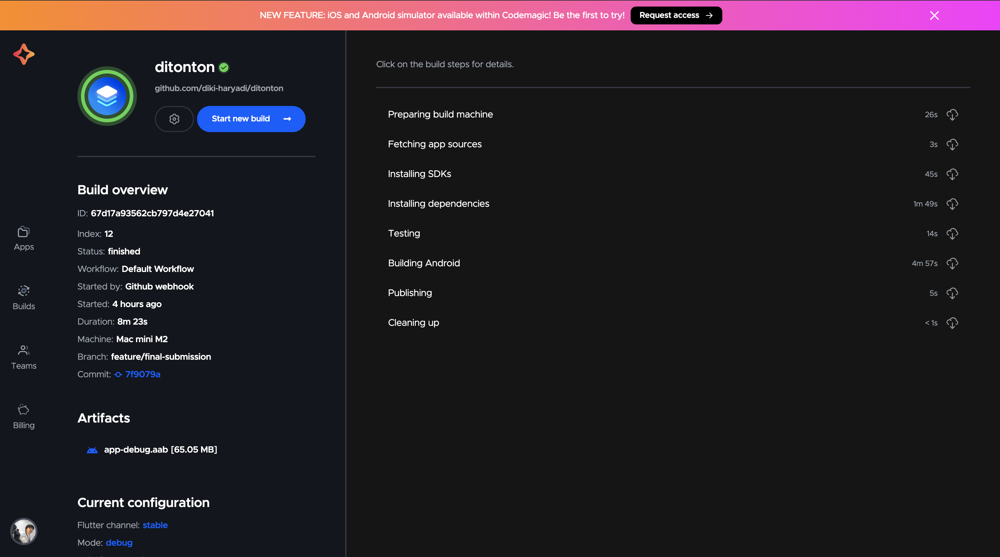

# Flutter Expert Project - TV Series

[](https://codemagic.io/app/67cf783638f44e239997e550/67cf783638f44e239997e54f/latest_build)

A Flutter application that showcases movies and TV series information, implementing clean architecture principles and following Flutter best practices.

## CI/CD Build Screenshot


*Screenshot of successful build from Codemagic CI/CD pipeline*

## Features

### Movies
- Browse Now Playing movies
- Discover Popular movies
- View Top Rated movies
- Search for specific movies
- View detailed movie information
- Add/Remove movies to/from Watchlist

### TV Series
- Browse Now Playing TV series
- Discover Popular TV series
- View Top Rated TV series
- Search for specific TV series
- View detailed TV series information
- Add/Remove TV series to/from Watchlist

### Core Features
- Clean Architecture Implementation
- Dependency Injection
- Local Data Persistence
- Unit Testing
- Widget Testing
- Integration Testing

## Project Structure

```
lib/
├── common/          # Common utilities, constants, and exceptions
├── data/            # Data layer implementation
│   ├── datasources/ # Data sources implementation
│   ├── models/      # Data models
│   └── repositories/# Repository implementations
├── domain/          # Domain layer with business logic
│   ├── entities/    # Business entities
│   ├── repositories/# Repository interfaces
│   └── usecases/    # Use cases implementation
└── presentation/    # Presentation layer
    ├── pages/       # UI pages
    ├── provider/    # State management
    └── widgets/     # Reusable widgets
```

## Getting Started

### Prerequisites
- Flutter SDK
- Dart SDK
- Android Studio / VS Code
- Android Emulator / iOS Simulator

### Installation
1. Clone this repository
2. Navigate to the project directory
3. Run `flutter pub get` to install dependencies
4. Run `flutter run` to start the application

## Testing

This project includes comprehensive testing coverage. To run the tests:

### For All Tests
Use the provided test script:
```bash
./test.sh
```

This will:
- Run all unit tests
- Run widget tests
- Generate coverage reports

### Prerequisites for Testing

Install lcov based on your operating system:

- **Linux**:
  ```bash
  sudo apt-get update -qq -y
  sudo apt-get install lcov -y
  ```

- **macOS**:
  ```bash
  brew install lcov
  ```

- **Windows**:
  1. Install [Chocolatey](https://chocolatey.org/install)
  2. Run:
     ```bash
     choco install lcov
     ```
  3. Set environment variables:
     - GENTHTML = C:\ProgramData\chocolatey\lib\lcov\tools\bin\genhtml
     - LCOV_HOME = C:\ProgramData\chocolatey\lib\lcov\tools

## Development Guidelines

- Follow clean architecture principles
- Write tests for new features
- Maintain code coverage
- Follow Flutter best practices
- Use meaningful commit messages

## License

This project is part of the Flutter Expert course by Dicoding Indonesia.

